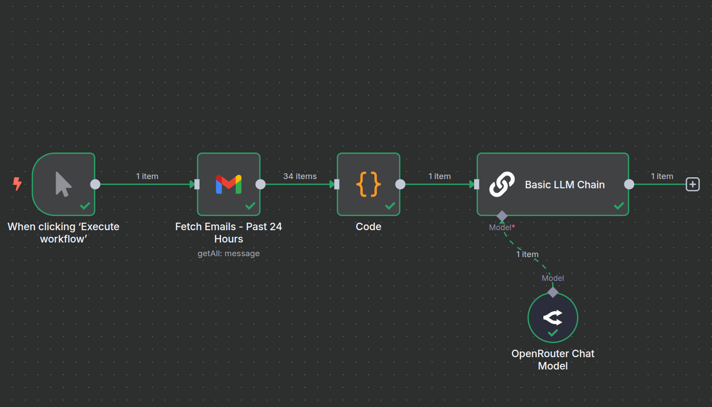
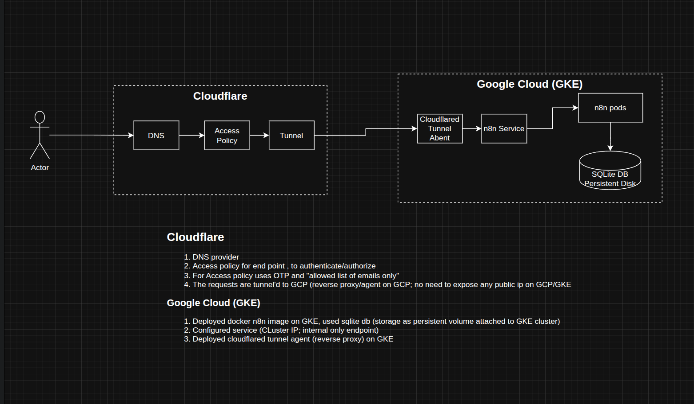

# Gmail Summary Agent

## Overview

An agent which reads emails from the last one day and summarizes them. It highlights key points and action items.

## Pre-requisites

*   python
*   uv
*   GCP account/project (I used cloudrun & GKE autopilot cluster)
*   OpenRouter and any LLM provider
*   Cloudflare account with a domain name

## Solution #1: Custom Python Solution

*   **Architecture:** Custom-built Python script that uses the Gmail OAuth API to fetch emails. It then utilizes `litellm` and prompt engineering to summarize the content of the emails.
*   **Key Files:**
    *   `main.py`: The main entry point of the application.
    *   `gmail.py`: Handles the communication with the Gmail API.
    *   `dockerfile`: Used to build the container image for deployment.
*   **Deployment:** Can be deployed locally or on Google Cloud Run. The necessary CLI commands for deploying to Cloud Run can be found in `docs/info.txt`.
*   **Customizations:** Refer to `config.yaml` to change the prompt or select GMAIL catogeries and other LLM configurations. As standard .env contains the LLM API keys.

## Solution #2: n8n No-Code Platform

*   **Architecture:** Built on the n8n no-code platform, leveraging pre-built nodes for Gmail and LLM integrations (refer to solution and workflow in below images; the workflow can be found in `docs\n8n-workflows`).
*   **Deployment:** Deployed on Google Kubernetes Engine (GKE) and reverse-proxied through a Cloudflare Tunnel (ZeroTrust Network). The necessary CLI commands for deploying to GKE can be found in `docs/info.txt` and the GKE deployment configuration files are in the `docs/deploy` folder.
*   **Security:** An additional layer of security is implemented using One-Time Passwords (OTP) on Cloudflare ZeroTrust Access.

### N8N Workflow

### Solution Diagram

## References

*   [Google Cloud Gmail API OAuth](https://developers.google.com/gmail/api/auth/web-server)
*   [Cloudflare DNS](https://www.cloudflare.com/dns/)
*   [Cloudflare Zero Trust Network](https://www.cloudflare.com/products/zero-trust/zero-trust-network-access/)
*   [Cloudflare Zero Trust Access](https://developers.cloudflare.com/cloudflare-one/applications/configure-apps/self-hosted-apps/)
